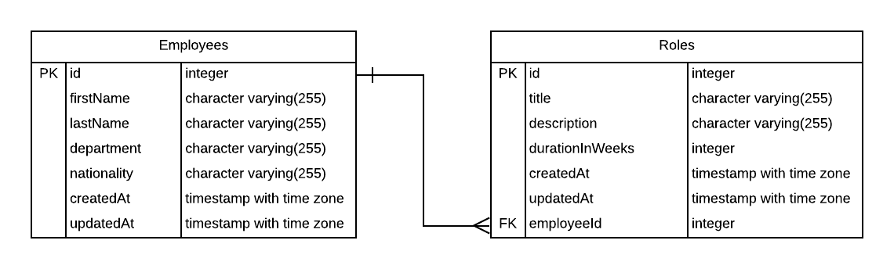

# Employee Statistics

This repo was created to get a better understanding of Sequelize.

### Inspiration
I want to store statistics about employees (department, nationality, etc.. ) and create assigned roles (retrospective organiser, sentry ninja, etc..).

### Details
A REST interface with two entities; Employee and Role. 

ER Diagram

The postgres DB is hosted on ElephantSQL for development/production. A local DB is used for unit tests.

### Routes

#### Employees

- `GET /api/employees`
- `GET /api/employees/{employeeId}`
- `POST /api/employees`
- `DELETE /api/employees/{employeeId}`
- `PUT /api/employees/{employeeId}`
	
#### Roles

- `GET /api/roles`
- `GET /api/roles/{roleId}`
- `POST /api/roles `
- `DELETE /api/roles/{roleId}`
- `PATCH /api/roles/{roleId}`